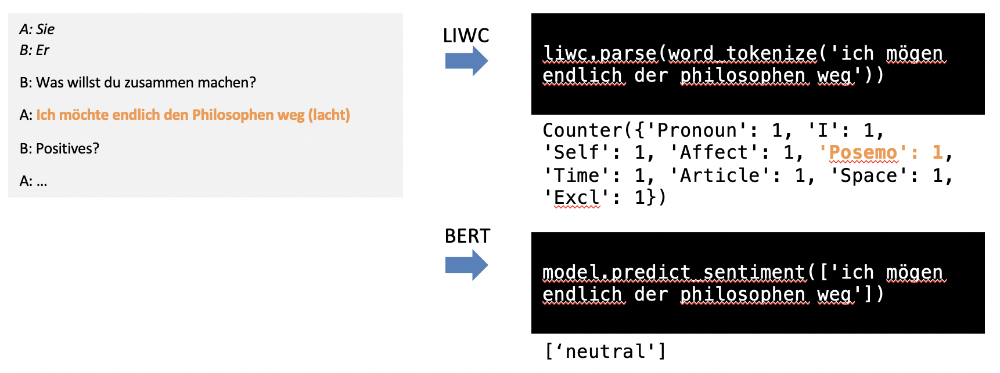

# Freud

## Overview
**Freud** examines the capabilitites of sentiment analysis in a depression research project. The main aim is to explore if and how conversations from couples with and without depression can be classified only by considering written transcripts of the conversation. The data was acquired as part of a research project at Heidelberg University Hospital.

Different methods were explored, including dictionary-based sentiment analysis with *Linguistic Inquiry and Word Count (LIWC)*, statistical models as *Latent Semantic Analysis* and *Latent Dirichlet Allocation* as well as a transfer learning approach with *Bidirectional Encoder Representations from Transformers (BERT)*. 

The results are promising as about 80% of the considered transcripts could be classified correctly. 

The source code and detailed results are contained in the jupyter-notebook *freud.ipynb*. The structure is as follows: 

1. Import and Preprocessing
2. Simple Metrics
3. Sentiment Analysis with Lingustic Inquiry and Word Count (LIWC)
4. Statistical Models and Topic Models 
5. Neural Networks and BERT 
6. Classification

The first subsection contains all required preprocessing steps to parse the transcripts in a dataframe representation. In subsection 2-5 the different features are calculated and visualized. Every feature is calculated for every transcript and the results are stored within a feature matrix. In subsection 6, the feature matrices are used to classify the transcripts.  

A presentation summarizing the study, the approach and the results is contained in *freud.pdf*. 

## Getting started 
The used libraries can be installed via the *requirements.txt* file. The transcripts are confidential and may be provided upon request, please contact <haas.alexanderjulian@gmail.com>. 

# Summary

## Data 
The sentiment analysis is performed on transcripts from couple conversations. The transcripts were acquired as part of the *Social Interaction in Depression (SIDE) study* at Heidelberg University Hospital (for more detailed information please take a look at <https://pubmed.ncbi.nlm.nih.gov/30287601>). The aim of the study is to examine the differences in social interaction between couples with and without depression. 

The study included two groups of heterosexual couples. The *depressed group* consists of couples in which only the female partner suffers from a diagnosed major depressive disorder (MDD), whereas the male partner does not suffer from MDD. The *non-depressed group* consists of couples in which both partners do not suffer from MDD. 

One aim of the study was to test the effectiveness of a new treatment option for depressed couples. Therefore, the depressed couples were divided into two groups, one received therapy as usual and the other received the new treatment. The couples were examined with different tests before and after the treatment. One part of the examination was a conversation of 10 minutes duration which was recorded. As a requirement, the couples should talk **positively and praising** to each other.

The non-depressed couples were examined at one time point (T0), the depressed couples at two time points (T0 before therapy and T1 after therapy). The analysis in this practical is based on the transcripts of the recorded conversations at T0 to exclude effects the therapy might have on depressed couples. The number of couples is **n=43** for the non-depressed group and **n=61** for the depressed group.

Information on the measurement process and a part of a sample transcript is presented in the following figure:

## Feature Analysis 

The following section gives an overview of the feature analysis. Details on the libraries and hyperparameters can be found in the corresponding section in *freud.ipynb*. The numbering of this section is corresponding to the numbering of the sections in the jupyter-notebook.

The analysis of transcripts can be performed along different dimensions. First, the subject of analysis for which the feature values are calculated can be the couple or the individual. Second, the textual granularity can be document level, paragraph level, sentence level, and even more fine granular up to the subword level. Third, the features can be calculated on different preprocessing levels such as raw text, stemmed text, and lemmatized text.  For this practical the analysis is performed on *couple-level*, *person-level*, *document-level* and *paragraph-level* and most of the features are calculated on the *lemmatized* version of the text (if otherwise it is specified in the jupyter-notebook). The dimensions are visualized in the figure below.

### 1. Preprocessing
For transcript parsing, *Parser* and *Queryable* (both in *utils/querying.py*) are used to read the transcripts from docx-files and the metadata from a xlsx-file. For every couple the couple-id from the metadata file is used. The metadata-file includes detailed information on the medical diagnosis of the two partners.

Every transcript is represented as a sequence of its sentences and each sentence and paragraph is assigned an id. The depression status of the couple (*is_depressed_group*), the *speaker* and the *gender* of the speaker as well as a depression label (*hamilton* for Hamilton Depression Rating Scale) is added for every sentence. 

To increase processing speed the parsed dataframe is stored as csv-file and can be loaded from disk directly.

### 2. Simple Metrics 
In this section simple counting metrics are calculated to examine whether differences in the depressed and non-depressed group can be found. First, **basic statistics** are calculated, including word-count, paragraph-count, and number of words per paragraph. Second, **speech sophistication** is measured by calculating Flesch Reading Ease, vocabulary size and term-frequency inverse document-frequency (TFIDF). Details on the calculation can be found in *freud.ipynb* as well as in the summary report of the "Sigmund"-project of the lecture Text Analytics. 

### 3. Sentiment Analysis with Linguistic Inquiry and Word Count (LIWC)
Sentiment analysis is performed using *Linguistic Inquiry and Word Count (LIWC)*, a dictionary-based method for sentiment analysis (<https://www.liwc.app/>). The version used contains 68 different emotional and textual categories. Each category has an associated list of words. The library counts the number of words in an input text fragment for each category and outputs a vector with the counts per category.

As the most recent version of LIWC is a commercial product, the German LIWC dictionary of 2001 is used for the analysis as it can be used without charge for scientific purposes (<https://www.klinikum.uni-heidelberg.de/zentrum-fuer-psychosoziale-medizin-zpm/institut-fuer-psychosoziale-praevention/forschung/forschungsstelle-fuer-psychotherapie-fost/forschung/instrumente/liwc>). 

The sentiment analysis with LIWC is divided into 3 groups. The analysis is performed both qualitatively by creating different plots and quantitatively by creating a feature matrix which is used for classification (-> section 6).

#### 3.1 Document Level
Firstly, the analysis is performed on *document level* by calculating LIWC scores for every transcript, considering the transcript as a whole, and comparing the **distribution between transcripts** from depressed and non-depressed couples. It can be thought of as "integral over the emotional flow" without considering the fluctuations along the conversation. To capture differences one the one hand between couples and on the other hand also between the individuals, the analysis is performed once for couples (aggregating over both partners, comparing on *couple level*) and once for the partners separately (comparing on *person level*).

One example for the qualitative analysis was the creation of heatmaps intended to find qualitative patterns, here for the LIWC category positive emotion:

#### 3.2 Paragraph Level
Secondly, the analysis is performed on *paragraph level* by calculating LIWC scores for every paragraph and then calculating aggregated statistics as mean, median, maximum, variance and sum over all paragraphs of a transcript. Therefore, the perspective is on the **distribution of emotion within a transcript**, e.g. emotional peaks and fluctuations. As in the section above, the analysis is performed both on *couple level* and *individual level*.

One example for the LIWC category positive emotion is visualized in the following 2 figures:

The figure shows that the sum (mean over couples and distribution over couples) for positive emotion is slightly higher in the non-depressed group. This would align well with the expectation of less positive emotion in depressed couples although the difference is rather small. Furthermore, it is interesting to notice that the variance between couples in the depressed group is higher than the variance between couples in the non-depressed group. In addition, it seems that depressed couples tend to have more extreme values on both ends of the spectrum which would align with the expectation that depressed couples tend to deviate from the norm into the more extreme.

#### 3.3 Interaction Metrics 
In this subsection the interaction of positive and negative emotion during the conversation between the two partners is examined. One hypothesis was that the **emotional response** of one partner on positive and negative emotion of the other partner might be different between depressed and non-depressed couples. A second hypothesis was that the **divergence** between positive emotion of one partner and negative emotion of the other partner might be larger in depressed couples than in non-depressed couples (high value in negative emotion for one partner while high value in positive emotion for the other partner). 

Four plots serve to qualitatively examine the interaction:  

1. The interaction of positive emotion and negative emotion of the two partners is plotted without any modification both for depressed and non-depressed couples.
2. As the trajectories are fluctuating substantially for subsequent paragraphs a **sliding window** averaging is introduced in order to smooth the curves.
3. In order to capture the differences in emotional divergence between depressed and non-depressed couples the **maximum divergence between positive emotion of one partner and negative emotion of the other partner** was measured **within a sliding window** (max(diff(posemo_female,negemo_male),diff(posemo_male,negemo_female)))
4. The same plot as in 3. but normalized with the largest value (divided by max(posemo_female,posemo_male,negemo_female,negemo_male))

An example plot for the LIWC category positive emotion for the first case is presented in the following figure, the other plots can be found in *freud.ipynb*:

Unfortunately, no consistent qualitative pattern could be found in the interaction plots which holds for a majority of the couples within one group.

### 4. Statistical Models and Topic Models 

In this section statistical models are used to find out if the transcripts of depressed and non-depressed couples can be distinguished from each other by the distribution of latent topics.

#### 4.1 Latent Semantic Analysis (LSA)
A transcript is considered as a document, so the analysis is performed on *document level*. For the analysis, the *lemmatized version without stopwords* of the transcripts is used. 

In a first step the doc-term-matrix is constructed counting the number of times a term occurs in a document. Latent topics are then identified using singular value decomposition. The number of topics was chosen based on the coherence value and the classification performance. A good compromise between the two could be achieved with n=20 topics.

The quality of the model is assessed by interpreting the terms associated with the topics, by constructing a heatmap with transcript similarities and finally by classification results (-> section 6). More information on Latent Semantic Analysis can be found in Deerwester et al. <http://lsa.colorado.edu/papers/JASIS.lsi.90.pdf>. Latent Semantic Analysis is performed using the gensim library (<https://radimrehurek.com/gensim/>). 

#### 4.2 Latent Dirichlet Allocation (LDA)
Latent Dirichlet Allocation is a generative model which assumes a word in a document to be created by considering the distribution of topics over documents and the distribution of words over topics. Here, we use the inverse procedure to estimate the distribution of topics over documents and the distribution of words over topics given a set of documents. More details can be found in Blei et al. <https://www.jmlr.org/papers/volume3/blei03a/blei03a.pdf?ref=https://githubhelp.com>. 

The LDA analysis is also performed on *document level* and the *lemmatized version without stopwords*. The quality of the estimated model is assessed by using the coherence score, a distance map and the classification results (-> section 6).

#### 5. Neural Networks / BERT 
Finally, a transfer learning approach with a pretrained Bidirectional Encoder Representations from Transformers (BERT) is tested. Therefore, a BERT model pretrained on 1.834 million German-language samples is used to classify sentiment of paragraphs as either **positive, negative or neutral**. (<https://huggingface.co/oliverguhr/german-sentiment-bert>) The most assigned category for the paragraphs of a transcript is then used as category for the transcript. 

## Classification Results

The following table contains the classification results for all features evaluated independently of each other. The classification was performed by 10-fold cross-validation with a Random Forrest Classifier. As the variance of different cross-validations was high, 10 repeats were performed. As the dataset is unbalanced a stratified version of cross-validation was used. The table reports the mean and standard deviation of accuracy and F1-measure for each feature. 

| Nr. | Feature | Granularity Level | Subject Level | F1 mean | F1 std | Accuracy mean | Accuracy std |
|---| ----------- | ------------------|---------------|---------|--------|----------|--------------|
|2.1| Word-count  | Document          | Couple        |  0.595  |  0.133 | 0.503 | 0.136 |  
|2.1| Word-count  | Document          | Person        |  0.589  |  0.150 | 0.487 | 0.155 |  
|2.2| Number-of-unique-words | Document | Couple      |  0.604  |  0.161 | 0.553 | 0.151 |  
|2.2| Number-of-unique-words | Document | Person      |  0.587  |  0.149 | 0.530 | 0.150 | 
|2.2| Flesch  | Document     | Couple                 |  0.578  |  0.160 | 0.540 | 0.141 |  
|2.2| Flesch  | Document     | Person                 |  0.538  |  0.140 | 0.456 | 0.141 |   
|2.2| TFIDF   | Document     | Couple                 |  0.753  |  0.082 | 0.670 | 0.111 |   
|3.1| LIWC        | Document          | Couple        |  0.663  |  0.113 | 0.542 | 0.127 |  
|3.1| LIWC        | Document          | Person        |  0.687  |  0.099 | 0.579 | 0.116 | 
|3.2| LIWC        | Paragraph         | Couple        |  0.685  |  0.088 | 0.591 | 0.119 | 
|3.2| LIWC        | Paragraph         | Person        |  0.821  |  0.085 | 0.778 | 0.115 | 
|4.1| LSA         | Document          | Couple        |  0.695  |  0.119 | 0.629 | 0.129 |
|4.2| LDA         | Document          | Couple        |  0.656  |  0.124 | 0.592 | 0.134 |
|5  | BERT        | Document          | Couple        |  0.589  |  0.139 | 0.505 | 0.135 |

In order to determine the accuracies for both classes (depressed=1 and non-depressed=0), a confusion matrix was calculated for one classification with Random Forrest Classifier using all features. 

## Interpretation  
- The classification result is considerably better than chance but with substantial standard deviation. Therefore, a robust binary classification only based on the transcripts is challenging. Using all features the result of a 10-fold stratified cross-validation with 10 repeats with a Random Forrest classifier is: 
    - **F1-measure =  0.82, std = 0.08**
    - **accuracy = 0.75, std = 0.11**.
- Interestingly, the model is able to detect nearly all depressed couples (accuracydepressed-group=0.93), but has difficulties to classify the non-depressed couples correctly (accuracynon-depressed-group=0.64). In a clinical setting, it would classify many couples without a depression diagnosis as depressed (more correctly in this case: as having a female depressed partner). Therefore, it would be interesting to further explore the cause, if the model is just wrong or if the false positive classified non-depressed couples show patterns found also in depressed couples.
- The best classification result could be achieved using Random Forrest Classifier. The feature with the best classification result was *LIWC* on *paragraph level* and *person level* which is considering the LIWC distribution within the transcripts and also the behavior of the two partners individually. This feature alone yields similar classification performance as all features combined. However, LIWC is not able to capture subtle emotions which is indicated in the figure below. Therefore, it might be interesting to use neural network based classifiers such as BERT on *paragraph level* and *person level* to further improve the classification result. 

- The classification results of the statistical models and the BERT model were quite weak. However, those models were evaluated only on *document level* and *couple level*. As LIWC results on those levels were comparably low, it might be interesting to evaluate the statistical models also on *person level* and *paragraph level*. 
- The interaction metrics did not show a clear qualitative pattern. However, as visual reasoning with complex trajectories over many couples is challenging, exploring ways to quantify the interaction and test the classification performance might be interesting as well.
- The specific conversational setting in this study (couples should conduct a *“positive conversation”*) might not be best suited for transcript-based classification as both partners are asked to use positive words and the negative sentiment might therefore be more present between the lines. For a transcript-only based classification scenario, it might be more helpful if the couples are asked to talk about topics that trigger the usage of negative words and to omit the positive framing. 
- A framework for qualitative and quantitative conversation analysis is helpful and might be useful also for other psychological research questions.

## Future directions 
- I think the most interesting approach would be pre-training a BERT model on psychological data which is able to capture more nuances and apply it to the transcripts.
- As explained in results, another promising approach might be to evaluate the statistical models (Latent Semantic Analysis, Latent Dirichlet Allocation) and BERT on *paragraph level* and *person level*.
- Furthermore, it would be interesting to evaluate if therapy success of depressed couples (at T2) can be quantified with this approach.
- Another interesting direction would be to further explore the "decision boundary" and the reasoning of the model what differentiates a non-depressed from a depressed couple in this specific setting.   

## Acknowledgements
I want to thank Prof. Dr. Michael Gertz for the possibility to conduct this practical and Prof. Dr. Beate Ditzen, Dr. Corina Aguilar-Raab and Friederike Winter for sharing the data. 

## Bibliography 

